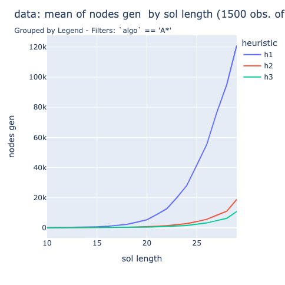
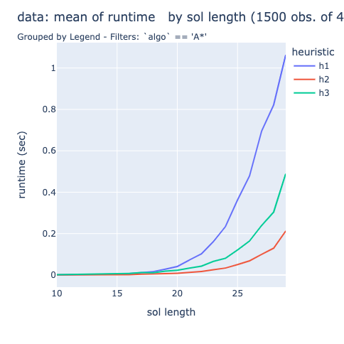
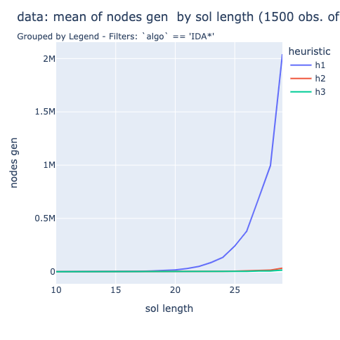
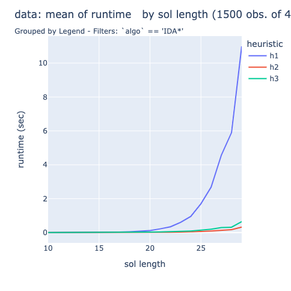
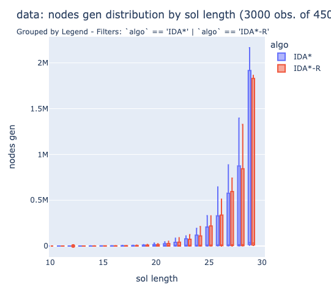
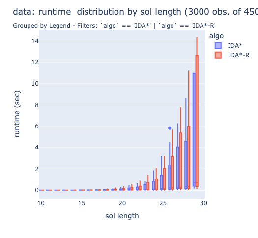

# Exp 1 Results Summary

Input: **500 8-puzzles**

&nbsp;

## Algorithms and Heuristics: &nbsp; A\*, IDA* &nbsp;&times; &nbsp; h1, h2, h3
### A\*

Time Complexity (nodes) | Runtime (measured)
------------ | -------------
 | 

### IDA\*
(with tabular node ordering)

Time Complexity (nodes) | Runtime (measured)
------------ | -------------
 | 

h3 generates fewer nodes than h2, but runs slower (on the 8-puzzle) due to the 'slower' (more calculation intensive) heuristic

&nbsp;

## Heuristic Quality: &nbsp; % error, &nbsp;b\*
### Mean Effective Branching Factor (b\*)

&nbsp; | h1 | h2 | h3
------------ | ------------- | ------------ | -------------
A\* | 1.45 | 1.29 | 1.26
IDA\* | 1.56 | 1.31 | 1.26
IDA\*-R | 1.56 | 1.30 | 1.26

### Heuristic % Error

heuristic | % error (mean) | stddev
------------ | ------------- | ------------ 
h1 | 66.9% | 6.8% 
h2 | 35.7% | 11.5%
h3 | 30.8% | 10.3%

&nbsp;

### Heuristic % Error vs. b*
&nbsp; | &nbsp;
------------ | -------------
 |  
 | 

&nbsp;

## IDA\*: Effect of Random Node Ordering
(all heuristics: h1, h2, h3)

Time Complexity (nodes) | Runtime (measured)
------------ | -------------
 | 

On 8-puzzle, random ordering performs comparably to (on average) or generates fewer nodes (in the worst case) than tabular node ordering, 
...but... IDA\*-R has a longer runtime in practice. 

It seems that on the 8-puzzle, that extra line of code makes a significant difference. Curious to see how this differs on the 15-puzzle, a larger search space.
